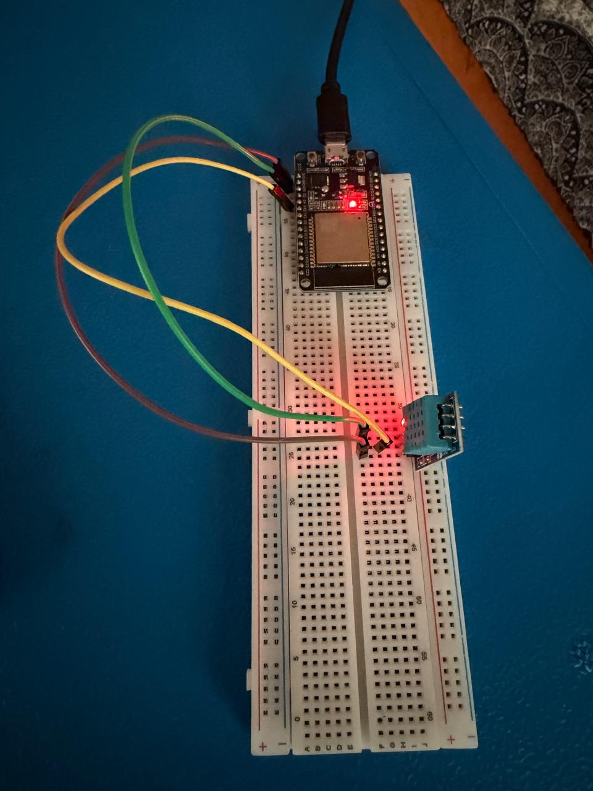
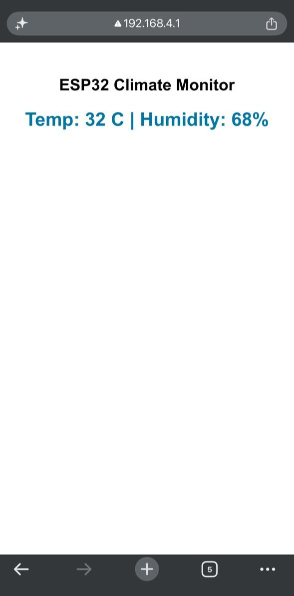

# 🌡️ ESP32 DHT11 WiFi Climate Monitor

An IoT project built using the **ESP32** and **DHT11 sensor** that creates a Wi-Fi Access Point and hosts a web page displaying live temperature and humidity readings.

---

## 🚀 Features

- 📶 ESP32 works as a Wi-Fi Access Point
- 🌡️ Real-time Temperature Monitoring
- 💧 Real-time Humidity Monitoring
- 📱 View readings on any phone or laptop connected to the ESP32 Wi-Fi
- ⚡ Simple and lightweight web interface

---

## 🛠️ Components Used

- ESP32 Development Board
- DHT11 Temperature & Humidity Sensor
- Breadboard
- Jumper Wires
- USB Cable

---

## 🔌 Circuit Connections

| DHT11 Pin | ESP32 Pin |
|------------|------------|
| VCC | 3.3V |
| GND | GND |
| DATA | GPIO **4** *(Change this if you used a different pin)* |

---

## 📷 Circuit Setup




---

## 🌐 Web Interface



---

## ▶️ How to Use

1. Upload the code to the ESP32.
2. Power the ESP32.
3. Connect your phone or laptop to the ESP32 Wi-Fi network.
4. Open the IP address shown in the Serial Monitor.
5. View live temperature and humidity values.

---

## 📂 Project Structure

```
ESP32-DHT11-WiFi
│
├── ESP_to_webpage_dhtsensor_wifi.ino
├── README.md
└── images
    ├── circuit.jpg
    └── output.jpg
```

---

## 🔮 Future Improvements

- Auto-refresh webpage
- OLED display integration
- ThingSpeak / Blynk Cloud support
- Data logging
- Responsive dashboard

---

## 👨‍💻 Author

**Vishal Varma**

B.Tech Electronics & Communication Engineering (ECE)

Interested in Embedded Systems, IoT and AI.
